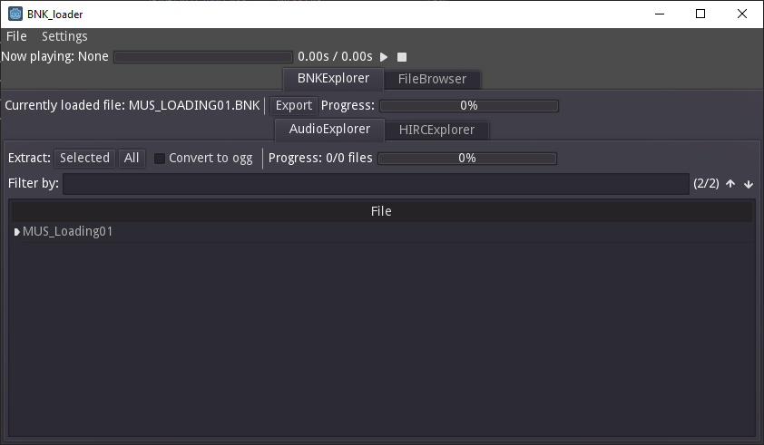
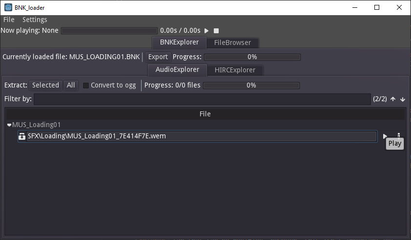
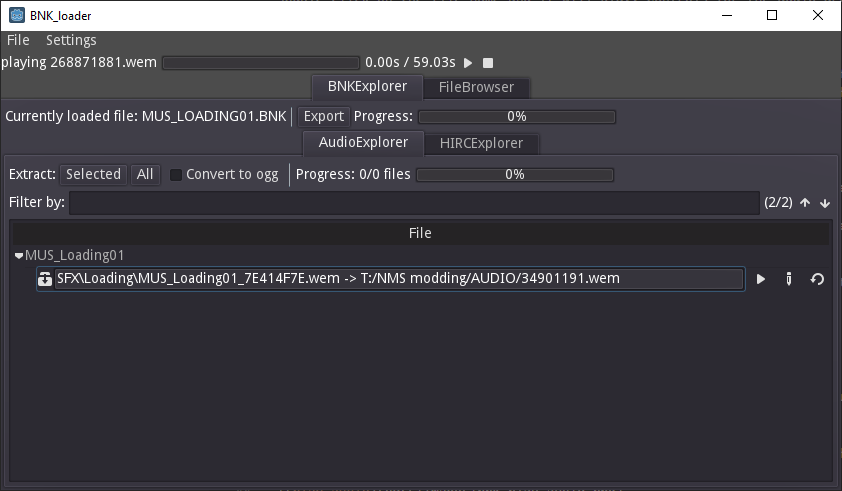

# BNK Editor

BNK Editor is designed to open and edit Wwise .bnk files.
Currently it is still fairly early in development and mostly just supports No Man's Sky, but ideally I'd like it to be able to support .bnk files from other games too.

BNK Editor proudly made with [Godot](https://godotengine.org/)

## Usage

The following instructions will be provided for No Man's Sky.

### Initial Setup

Double click on the binary to open it.
The first option that needs to be set is the location of the audio folder (PCBANKS/AUDIO/WINDOWS).
If this folder doesn't exist you will need to extract the audio files from your .pak files. There are many ways to do this. See [here](https://stepmodifications.org/wiki/NoMansSky:The_Modding_Basics#Unpacking_the_Game_Assets) for one potential method.
This option is set By selecting `File` from the top menu and selecting `Load Directory...`
This will open up a popup which will allow you to select the `WINDOWS` folder.
Once this folder has been loaded the folder should be loaded in the `File Browser` tab.

### Playing a loose WEM file

Under the `File Browser` tab there will be many .wem and .bnk files listed. To play an individual wem file, simply souble click on the file name and it will play. Controls for the audio are at the top of the application.

### Loading a BNK file

To load a .bnk file, we simply double click on it. Since there are lots of files in the `WINDOWS` folder it is recommended that the `Filter file type` drop down has `BNK` selected so that only .bnk files show up.
As an example double click on the `MUS_LOADING01.BNK` file from the list. It should look as shown in the following image.

Now that the editor has changed to the `BNK Explorer` tab, you will notice 2 sub tabs; the `Audio Explorer` tab, and the `HIRC Explorer` tab.
For now we will concern ourselves with just the `Audio Explorer` tab, however there are some values in the `HIRC Explorer` tab that can be modified, however, this isn't important yet...

The important thing to understand with the `Audio Explorer` tab is that it shows a list of all the audio events that are handled by the particular .bnk file.

Audio files have two types:

- **Embedded** -  - The audio file is stored within the bnk file itself
- **References** -  - The audio file is one the external .wem files floating around in the `WINDOWS` folder (or language sub-folders).

In both cases we may play the audio file by pressing the play button () on the right side of the view:

### Replacing audio

The current version of the BNK editor (v0.0.5) only supports replacing embedded audio files (despite them requiring more work to replace, but that's just how it is for now. Full support will come later).

Replacement is easy, simply click the pencil icon () to the right of the play icon in the above image and select the .wem file you wish to replace the embedded audio with.
Currently you will need to create the .wem file yourself (there should be many resources online for how to do this, google is your friend!), but hopefully in the future this program will be able to convert audio to .wem for you.
Once you have selected a file, you will see the following:

Your file path will be different, but you can see the audio file that will be replacing the given one.

Once you are happy with the replacement, click the `Export` button next to the name of the currently loaded bnk and the .bnk file will be exported with the modified audio in the same location as the original file but with `.modified` appended to the file name.

## Known issues

- Replacing an audio and pressing the play button will play the original audio, not the replacing one. This may not be an "issue" per se, but something that needs to be handled better.
- Searching is currently bad. In the future I want to support searching by either name or ID.
- The WEM and BNK options in the file type filter don't work exclusively. If you select one then the other you will see no files. Current work-around is to select the ALL option again then select the other one you want.
- Referenced audio files cannot be replaced.
- New audio events cannot be added.
- Settings menu is currently useless and needs to be removed (or current useful setting under `File` needs to be moved).
- Loading multiple .bnk files in a row doesn't reset the number of files for the audio filter in the `BNK Explorer` tab.
- Certainly more...

## Contibuting

There is still a lot of work that needs to be done on this program, however I'd like to start being able to support more games than No Man's Sky eventually, so contributing files which can't be opened with this as well as details on the file structure would be incredibly useful.
